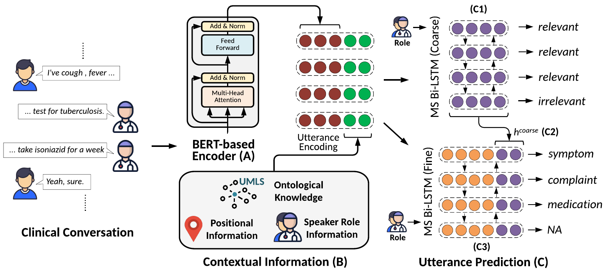

<h1 align="center">
  MedFilter
</h1>
<h4 align="center">Improving Extraction of Task-relevant Utterances through Integration of Discourse Structure and Ontological Knowledge</h4>
<p align="center">
  <a href="https://2020.emnlp.org/"></a>
  <a href="https://aclanthology.org/2020.emnlp-main.626/"></a>
    
  </a>
</p>

<h2 align="center">
  Overview of MedFilter
  
</h2>

*Overview of MedFilter. MedFilter first encodes each utterance of the given conversation using a BERT-based encoder (A). The obtained utterance embedding is concatenated with contextual information like speaker role, position of utterance in the conversation, and ontological knowledge (B). This is then fed to a MS-BiLSTM (C1) for medical relevance identification. MS-BiLSTM leverages speaker role information to learn speaker-specific context for each utterance. This contextual representation is concatenated with the utterance embedding (C2) and passed through another MS-BiLSTM (C3) which focuses on fine-grained categorization. Both tasks are jointly learned. Refer to Section 3 for more details.*

# Code structure:

### Install Dependencies
`nltk==3.4.5, tqdm==4.41.1, sklearn==0.0, pymongo==3.10.1, pytorch==1.1.0, transformers(hugging-face)==2.3.0`

### Recover BERT-FT embeddings

Run `bert_main.py` to fine-tune the BERT embedding (bert-base-uncased) on the training set.
```
python bert_main.py --model bert --gpu <GPU> --seed 1 --name <NAME>
```
Convert the PyTorch model into TF model using HuggingFace transformers library.
```
python <TRANSFORMER_DIR>/transformers/src/transformers/convert_bert_pytorch_checkpoint_to_original_tf.py \
--model_name bert_model \
--pytorch_model_path ./bert_models/<NAME>/pytorch.bin \
--tf_cache_dir ./bert_models/<NAME>/tf_model
```
Put config and vocab files from original BERT model into the new directory.
```
cd ./bert_models/<NAME>/tf_model/
cp <bert_base_uncased_dir>/vocab.txt .
cp <bert_base_uncased_dir>/bert_config.json .
mv bert_base_uncased.ckpt.index bert_model.ckpt.index
mv bert_base_uncased.ckpt.meta bert_model.ckpt.meta
mv bert_base_uncased.ckpt.data-00000-of-00001 bert_model.ckpt.data-00000-of-00001
cd ..
```
Use [bert-as-service](https://github.com/hanxiao/bert-as-service) to get the BERT representation for each utterance. Start the bert-as-service server on command line.

```
bert-serving-start -model_dir ./bert_models/<NAME>/tf_model/ -num_worker=2 -device_map 3 -max_seq_len 64
```
Then run `dump_bert_client.py` to dump the embedding for each conversation separately.
```
python dump_bert_client.py --embed <EMBED_NAME> --data_dir <DATA_DIR>
```
Once all embeddings are dumped to the directory (BERT_FT_EMBED_DIR), they are used as non-learnable features for MedTopic.

### Recover UMLS Semantic Types

1. Obtain a UMLS installation and then install QuickUMLS. [This](https://github.com/Georgetown-IR-Lab/QuickUMLS#installation) page provides detailed instructions to install both packages.
2. QuickUMLS can then be used to map phrases in the text to CUIs and corresponding semantic-types ([full list](https://metamap.nlm.nih.gov/Docs/SemanticTypes_2013AA.txt)).
```
from quickumls import QuickUMLS
matcher = QuickUMLS(quickumls_fp, overlapping_criteria, threshold,
                    similarity_name, window, accepted_semtypes)
```
```
text = "You have diarrhoea"
matcher.match(text, best_match=True, ignore_syntax=False)
```
Output:
```
[[{'start': 9,
   'end': 18,
   'ngram': 'diarrhoea',
   'term': 'diarrhoea',
   'cui': 'C0011991',
   'similarity': 1.0,
   'semtypes': {'T184'},
   'preferred': 0}]]
```
Details about different arguments are provided [here](https://github.com/Georgetown-IR-Lab/QuickUMLS#apis). We use default arguments for all QuickUMLS experiments in the paper.

Each utterance

### Run utterance classifier
```
python multi_label_seq_tagger.py --batch 16 --data_split --embed <BERT_FT_EMBED_DIR> \
--epoch 300 --feat speaker,position,semantic --feat_cat 3,4,133 \
--feat_dim 8,4,8 --ind_cat all --l2 0.0 --log_db <LOG_DB_DIR> \
--loss med_tag,med_class --loss_fact 1.0,1.0 --lr 0.0005 --model multih-bilstm \
--name <NAME> --rnn_dim 1024 --rnn_drop 0.0 --rnn_layers 1 --seed 2 \
--target med_class_auc --gpu 0 --max_conv_len 128
```

### Citation:

```bibtex
@inproceedings{khosla-etal-2020-medfilter,
    title = "{M}ed{F}ilter: {I}mproving {E}xtraction of {T}ask-relevant {U}tterances through {I}ntegration of {D}iscourse {S}tructure and {O}ntological {K}nowledge",
    author = "Khosla, Sopan  and
      Vashishth, Shikhar  and
      Lehman, Jill Fain  and
      Rose, Carolyn",
    booktitle = "Proceedings of the 2020 Conference on Empirical Methods in Natural Language Processing (EMNLP)",
    month = nov,
    year = "2020",
    address = "Online",
    publisher = "Association for Computational Linguistics",
    url = "https://www.aclweb.org/anthology/2020.emnlp-main.626",
    doi = "10.18653/v1/2020.emnlp-main.626",
    pages = "7781--7797"
}

```

For any clarification, comments, or suggestions please create an issue or contact [Sopan](sopank@cs.cmu.edu).
